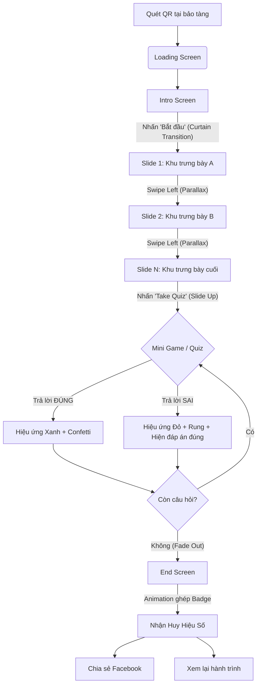

# Hệ Thống Luồng Trải Nghiệm (User Flow): Dấu Di Sản

Tài liệu này mô tả chi tiết luồng trải nghiệm người dùng (End-to-End User Flow) từ điểm chạm đầu tiên (Entry) đến điểm kết thúc (Terminal), bao gồm các hiệu ứng (effects), kịch bản thay thế (alternate flows), và xử lý ngoại lệ (exception handling).

---

## Sơ Đồ Luồng Tuyến Tính (Linear Flow Diagram)

---

## 1. Entry (Điểm vào: Quét QR & Khởi tạo)
- **Hành động:** Người dùng quét mã QR tại bảo tàng bằng camera điện thoại.
- **Luồng chính (Happy Path):** Trình duyệt mở URL `index.html`. Hệ thống tải file `flow.yaml` và các assets cơ bản (ảnh intro, CSS, JS).
- **Hiệu ứng (Effect):** Màn hình loading mờ ảo (fade-in) với logo dự án nhấp nháy nhẹ (subtle pulse) trong lúc chờ tải dữ liệu.
- **Xử lý ngoại lệ (Exception & Fallback):**
  - *Mạng yếu/Chậm:* Hiển thị thanh tiến trình (progress bar) mỏng ở cạnh trên. Nếu quá 3s chưa tải xong ảnh nền, fallback về màu nền gradient thương hiệu để người dùng không thấy màn hình trắng.
  - *Lỗi URL/Không tìm thấy dữ liệu:* Hiển thị thông báo thân thiện: "Có chút nhầm lẫn ở không gian này. Vui lòng quét lại mã QR nhé!" kèm nút "Thử lại".

## 2. Intro Screen (Màn hình chính)
- **Giao diện:** Cuốn hút (appealing) và đậm chất kể chuyện (storytelling). Background là hình ảnh/video chất lượng cao.
- **Hiệu ứng (Effect):** 
  - Background có hiệu ứng Ken Burns (zoom in/pan rất chậm) tạo chiều sâu.
  - Nút "Bắt đầu hành trình" có hiệu ứng *glow* hoặc *pulse* nhẹ nhàng mời gọi.
- **Hành động:** Nhấn nút "Bắt đầu hành trình".
- **Chuyển cảnh (Transition):** **Curtain Transition** - Màn hình tách đôi mở ra hai bên (hoặc kéo lên trên) để lộ không gian của slide đầu tiên, tạo cảm giác bước qua một cánh cửa thời gian.

## 3. Story & Exploration (Khám phá các khu trưng bày)
- **Giao diện:** 
  - **Top:** Logo dự án/bảo tàng nhỏ gọn, tinh tế.
  - **Center:** Hình ảnh/Video tràn viền hoặc layout nghệ thuật. Text ngắn gọn (tối đa 3-4 dòng). Nút phát Audio.
  - **Bottom:** Thanh điều hướng (Navigation dots/progress bar) trực quan.
- **Tương tác chính:** Vuốt trái (**Swipe Left**) để đi tiếp, vuốt phải (**Swipe Right**) để quay lại.
- **Hiệu ứng (Effect):** 
  - *Chuyển slide:* Parallax slide (ảnh nền trượt chậm hơn nội dung chữ) tạo cảm giác 3D mượt mà.
  - *Audio:* Khi bấm phát, nút Play chuyển thành biểu tượng sóng âm (equalizer animation) nhấp nhô theo nhịp.
- **Kịch bản thay thế (Alternate Flow):**
  - *Người dùng không bật tiếng (No Audio):* Nội dung text trên màn hình đã được tóm tắt đủ ý chính (Fallback cho audio).
- **Xử lý ngoại lệ (Exception):**
  - *Lỗi tải ảnh/audio:* Hiển thị placeholder tinh tế (icon hình ảnh mờ) và vẫn cho phép người dùng đọc text để đi tiếp, không block luồng.

## 4. Mini Game / Quiz (Thử thách)
- **Hành động:** Tại slide cuối cùng, nhấn nút "Tham gia thử thách" (Take Quiz).
- **Chuyển cảnh (Transition):** Giao diện Quiz **trồi lên từ dưới (Slide up từ bottom)**, đè lên màn hình hiện tại (Overlay), giữ lại một phần background cũ bị làm mờ (blur) để không làm mất context.
- **Luồng tương tác & Hiệu ứng (Alternate Flows):**
  - *Chọn đáp án ĐÚNG:* Nút đáp án sáng lên màu Xanh (Green glow) và nảy lên (upbeat bounce), phát âm thanh "Ting" vui tai (upbeat chime), thả một chút confetti (pháo giấy) nhỏ trên màn hình. Sau 1s, hiển thị Popup giải thích trượt từ trên cùng màn hình xuống (chiếm khoảng 30% nửa trên).
  - *Chọn đáp án SAI:* Nút đáp án chớp Đỏ (Red flash) và rung lắc nhanh (fast shake) biểu thị sự phản đối, màn hình rung nhẹ (subtle shake effect / haptic feedback nếu thiết bị hỗ trợ). Ngay sau đó, đáp án đúng được highlight màu Xanh để educate người dùng. Sau 1.5s, hiển thị Popup giải thích trượt từ trên cùng màn hình xuống.
  - *Chuyển câu hỏi:* Người dùng đọc giải thích trên Popup và nhấn nút "Tiếp tục". Popup trượt lên để đóng, đồng thời câu hỏi hiện tại mờ dần trượt sang trái, câu hỏi mới trượt vào từ bên phải.
- **Xử lý ngoại lệ:**
  - *Người dùng muốn thoát Quiz giữa chừng:* Vuốt xuống (Swipe down) để đóng Quiz, quay lại slide cuối cùng. Trạng thái Quiz được lưu tạm (không bắt làm lại từ đầu).

## 5. Terminal / End Screen (Nhận huy hiệu & Kết thúc)
- **Luồng chính:** Hoàn thành câu hỏi cuối cùng của Quiz. Màn hình Quiz đóng lại xuống dưới (tầm 0.5s). Màn hình endscreen trồi lên tầm 1s, nền đậm hơn chút (lai giữa màu giấy dó sáng và màu cung đình tối), không dùng fade.
- **Hiệu ứng xuất hiện Badge (Effect):** 
  - Hai mảnh ghép của huy hiệu từ hai bên mép màn hình **ùa vào giữa với tốc độ nhanh (ease-in-out)**.
  - Khi khớp lại, tạo ra một hiệu ứng lóe sáng (flash/glow) và nảy nhẹ (bounce/spring animation) thành một **Huy hiệu số (Digital Badge)** hoàn chỉnh.
- **Giao diện Terminal:** 
  - Lời chúc mừng ngắn gọn.
  - Nút "Chia sẻ lên Facebook" (nổi bật).
  - Nút "Xem lại hành trình" (thứ yếu).
- **Kịch bản thay thế & Ngoại lệ (Fallback & Exception):**
  - *Chia sẻ Facebook thành công:* Hiện Toast message "Đã chia sẻ thành công!".
  - *Lỗi Facebook API / Trình duyệt chặn popup:* Fallback sang nút "Copy Link" (Sao chép liên kết) hoặc "Tải huy hiệu về máy" (Download Image) để người dùng vẫn có thể khoe thành tích.

---

## 6. Global Exceptions & Edge Cases (Xử lý toàn cục)
- **Xoay màn hình (Orientation):** Trải nghiệm được thiết kế riêng cho màn hình dọc (Portrait)
- **Mất kết nối mạng (Offline Drop):** Nếu đang xem dở mà rớt mạng, các text đã tải vẫn xem được. Nếu bấm sang slide mới chưa có cache, hiện Toast message ở cạnh dưới: "Đường truyền đang gián đoạn, đang thử kết nối lại..." (Tự động retry ngầm).
