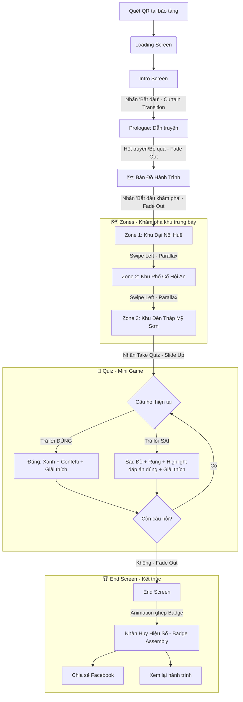

# Hệ Thống Luồng Trải Nghiệm (User Flow): Dấu Di Sản

Tài liệu này mô tả chi tiết luồng trải nghiệm người dùng (End-to-End User Flow) từ điểm chạm đầu tiên (Entry) đến điểm kết thúc (Terminal), bao gồm các hiệu ứng (effects), kịch bản thay thế (alternate flows), và xử lý ngoại lệ (exception handling).

---

## Sơ Đồ Luồng Tuyến Tính (Linear Flow Diagram)

```mermaid
graph TD
    A[Quét QR tại bảo tàng] --> LOAD(Loading Screen)
    LOAD --> INTRO[Intro Screen]
    INTRO -- Nhấn 'Bắt đầu' - Curtain Transition --> PRO[Prologue: Dẫn truyện]
    PRO -- Hết truyện/Bỏ qua - Fade Out --> MAP[🗺️ Bản Đồ Hành Trình]
    MAP -- Nhấn 'Bắt đầu khám phá' - Fade Out --> Z1

    subgraph ZONES[" 🗺️ Zones - Khám phá khu trưng bày "]
        Z1[Zone 1: Khu Đại Nội Huế]
        Z2[Zone 2: Khu Phố Cổ Hội An]
        Z3[Zone 3: Khu Đền Tháp Mỹ Sơn]
        Z1 -- Swipe Left - Parallax --> Z2
        Z2 -- Swipe Left - Parallax --> Z3
    end
    Z3 -- Nhấn Take Quiz - Slide Up --> QUIZ

    subgraph QUIZ_FLOW[" 🎯 Quiz - Mini Game "]
        QUIZ{Câu hỏi hiện tại}
        Q_OK[Đúng: Xanh + Confetti + Giải thích]
        Q_ERR[Sai: Đỏ + Rung + Highlight đáp án đúng + Giải thích]
        Q_NEXT{Còn câu hỏi?}
        QUIZ -- Trả lời ĐÚNG --> Q_OK
        QUIZ -- Trả lời SAI --> Q_ERR
        Q_OK --> Q_NEXT
        Q_ERR --> Q_NEXT
        Q_NEXT -- Có --> QUIZ
    end

    subgraph END_FLOW[" 🏆 End Screen - Kết thúc "]
        END[End Screen]
        BADGE[Nhận Huy Hiệu Số - Badge Assembly]
        SHARE[Chia sẻ Facebook]
        REPLAY[Xem lại hành trình]
        END -- Animation ghép Badge --> BADGE
        BADGE --> SHARE
        BADGE --> REPLAY
    end

    Q_NEXT -- Không - Fade Out --> END
```

---

## 1. Entry (Điểm vào: Quét QR & Khởi tạo)
- **Hành động:** Người dùng quét mã QR tại bảo tàng bằng camera điện thoại.
- **Luồng chính (Happy Path):** Trình duyệt mở URL `index.html`. Hệ thống tải file `flow.yaml` và các assets cơ bản (ảnh intro, CSS, JS).
- **Hiệu ứng (Effect):** Màn hình loading mờ ảo (fade-in) với logo dự án nhấp nháy nhẹ (subtle pulse) trong lúc chờ tải dữ liệu.
- **Xử lý ngoại lệ (Exception & Fallback):**
  - *Mạng yếu/Chậm:* Hiển thị thanh tiến trình (progress bar) mỏng ở cạnh trên. Nếu quá 3s chưa tải xong ảnh nền, fallback về màu nền gradient thương hiệu để người dùng không thấy màn hình trắng.
  - *Lỗi URL/Không tìm thấy dữ liệu:* Hiển thị thông báo thân thiện: "Có chút nhầm lẫn ở không gian này. Vui lòng quét lại mã QR nhé!" kèm nút "Thử lại".

## 2. Intro Screen (Màn hình chính)
- **Giao diện:** Cuốn hút (appealing) và đậm chất kể chuyện (storytelling). Background là hình ảnh/video chất lượng cao.
- **Hiệu ứng (Effect):** 
  - Background có hiệu ứng Ken Burns (zoom in/pan rất chậm) tạo chiều sâu.
  - Nút "Bắt đầu hành trình" có hiệu ứng *glow* hoặc *pulse* nhẹ nhàng mời gọi.
- **Hành động:** Nhấn nút "Bắt đầu hành trình".
- **Chuyển cảnh (Transition):** **Curtain Transition** - Màn hình tách đôi mở ra hai bên (hoặc kéo lên trên) để lộ không gian của Zone 1, tạo cảm giác bước qua một cánh cửa thời gian.

## 3. Prologue Screen (Dẫn truyện)
- **Trigger:** Sau khi Curtain Transition hoàn tất (tức là ngay sau khi người dùng nhấn "Bắt đầu hành trình").
- **Giao diện:**
  - Nền tối nhẹ (semi-transparent overlay) đè lên background của Intro, tạo cảm giác chuyển vào không gian riêng tư, thân mật.
  - Nhân vật linh vật **"Dấu"** (icon nhỏ gọn, hình con dấu cổ phong cách Chăm/Nguyễn) xuất hiện góc trên, nhấp nháy nhẹ.
  - Nội dung dẫn truyện hiển thị tuần tự từng đoạn với hiệu ứng **typewriter** (gõ chữ từng ký tự) và **fade-in theo dòng**.
  - Nút **"Đi thôi!"** (CTA chính) xuất hiện ở cuối sau khi text hoàn tất — có hiệu ứng pulse glow mời gọi.
  - Nút **"Bỏ qua"** (thứ yếu, nhỏ, góc dưới phải) cho phép skip toàn bộ prologue ngay lập tức.
- **Nội dung dẫn truyện (đọc theo thứ tự):**
  1. *"Chào bạn, mình là Dấu — và đây là hành trình của Dấu Di Sản."*
  2. *"Dấu đang lạc giữa những ký ức xưa, nép mình trong từng hiện vật lặng im. Bạn có muốn cùng Dấu đi qua những câu chuyện ấy, để đưa Dấu về nhà không?"*
  3. *"Chỉ cần theo bản đồ và bước đi qua từng chặng. Mỗi điểm dừng là một mảnh ký ức được kể lại thật gần gũi — kèm theo những thử thách nhỏ để bạn khám phá và 'đóng dấu' hành trình của riêng mình."*
  4. *"Khi tất cả các chặng hoàn thành, Dấu sẽ tìm được đường về. Và bạn sẽ mang theo một món quà nhỏ — như một kỷ niệm đẹp còn ở lại sau chuyến đi."*
  5. *"Đi thôi! Dấu chờ bạn đó."*
- **Hiệu ứng (Effect):**
  - Mỗi đoạn text fade-in từ dưới lên sau khi đoạn trước hoàn tất (stagger ~0.8s).
  - Hiệu ứng **typewriter** chỉ áp dụng cho dòng đầu tiên để gây ấn tượng, các dòng sau dùng fade-in thuần để không gây mệt mỏi.
  - Nhân vật "Dấu" rung lắc nhẹ (wiggle) khi câu cuối "Đi thôi!" xuất hiện.
- **Chuyển cảnh (Transition):** Nhấn "Đi thôi!" hoặc "Bỏ qua" → **chỉ nội dung** (text dẫn truyện, mascot, nút bấm) **Fade Out** mượt mà (0.5s); **background giữ nguyên liền mạch** — không chớp, không đổi nền. Nội dung Bản Đồ Hành Trình fade-in trên cùng nền đó.
  - **Lưu ý:** Prologue và Map dùng chung một lớp nền (shared background layer). Khi chuyển cảnh, nền không bị tắt/bật lại — chỉ lớp nội dung thay đổi.
- **Kịch bản thay thế (Alternate Flow):**
  - *Người dùng nhấn "Bỏ qua":* Skip ngay toàn bộ animation, chuyển thẳng đến Bản Đồ Hành Trình. Nền vẫn giữ nguyên.
- **Xử lý ngoại lệ (Exception):** Không có asset nặng trong màn hình này (text thuần) — không có rủi ro load failure.

## 3.5. Bản Đồ Hành Trình (Journey Map Screen)
- **Trigger:** Sau khi nội dung Prologue Fade Out hoàn tất (nền vẫn còn).
- **Giao diện:**
  - **Nền dùng chung với Prologue** — cùng một lớp gradient tối ấm liên tục, không tải lại hay chuyển đổi nền. Điều này tạo cảm giác không gian liền mạch giữa hai bước.
  - Ảnh bản đồ hành trình minh hoạ (`assets/images/map.png`) hiển thị ở trung tâm, chiếm ~80% chiều rộng màn hình, bo góc nhẹ, có hiệu ứng **fade-in scale** (zoom nhẹ từ 0.9 → 1.0).
  - Bản đồ thể hiện 6 checkpoint: Cổng Khởi Hành → Đại Nội Huế → Phố Cổ Hội An → Thánh Địa Mỹ Sơn → Đấu Trường Di Sản → Điện Phong Ấn.
  - Checkpoint đầu tiên (Cổng Khởi Hành) được đánh dấu nổi bật với hiệu ứng **pulse glow** vàng đồng, biểu thị "Bạn đang ở đây".
  - Tiêu đề ngắn phía trên bản đồ: "Hành trình của bạn" (serif, màu kem).
  - Nút CTA **"Bắt đầu khám phá"** ở dưới cùng, có hiệu ứng `breathe` giống nút "Bắt đầu hành trình".
- **Hiệu ứng (Effect):**
  - Ảnh bản đồ fade-in + scale nhẹ (0.5s ease-out).
  - Tiêu đề fade-in từ trên xuống (stagger 0.3s sau ảnh).
  - Nút CTA fade-in sau cùng (stagger 0.6s).
- **Chuyển cảnh (Transition):** Nhấn "Bắt đầu khám phá" → Fade Out (0.5s) → Zone 1 (Khu Đại Nội Huế).
- **Xử lý ngoại lệ (Exception):**
  - *Lỗi tải ảnh bản đồ:* Fallback hiển thị danh sách text các checkpoint trên nền gradient, không block luồng.

## 4. Story & Exploration (Khám phá các khu trưng bày)
- **Giao diện:** 
  - **Top:** Logo dự án/bảo tàng nhỏ gọn, tinh tế.
  - **Center:** Hình ảnh/Video tràn viền hoặc layout nghệ thuật. Text ngắn gọn (tối đa 3-4 dòng). Nút phát Audio.
  - **Bottom:** Thanh điều hướng (Navigation dots/progress bar) trực quan.
- **Tương tác chính:** Vuốt trái (**Swipe Left**) để đi tiếp, vuốt phải (**Swipe Right**) để quay lại.
- **Hiệu ứng (Effect):** 
  - *Chuyển slide:* Parallax slide (ảnh nền trượt chậm hơn nội dung chữ) tạo cảm giác 3D mượt mà.
  - *Audio:* Khi bấm phát, nút Play chuyển thành biểu tượng sóng âm (equalizer animation) nhấp nhô theo nhịp.
- **Kịch bản thay thế (Alternate Flow):**
  - *Người dùng không bật tiếng (No Audio):* Nội dung text trên màn hình đã được tóm tắt đủ ý chính (Fallback cho audio).
- **Xử lý ngoại lệ (Exception):**
  - *Lỗi tải ảnh/audio:* Hiển thị placeholder tinh tế (icon hình ảnh mờ) và vẫn cho phép người dùng đọc text để đi tiếp, không block luồng.

## 5. Mini Game / Quiz (Thử thách)
- **Hành động:** Tại Zone 3 (Khu Đền Tháp Mỹ Sơn) — zone cuối cùng — nhấn nút "Tham gia thử thách" (Take Quiz).
- **Chuyển cảnh (Transition):** Giao diện Quiz **trồi lên từ dưới (Slide up từ bottom)**, đè lên màn hình hiện tại (Overlay), giữ lại một phần background cũ bị làm mờ (blur) để không làm mất context.
- **Luồng tương tác & Hiệu ứng (Alternate Flows):**
  - *Chọn đáp án ĐÚNG:* Nút đáp án sáng lên màu Xanh (Green glow) và nảy lên (upbeat bounce), phát âm thanh "Ting" vui tai (upbeat chime), thả một chút confetti (pháo giấy) nhỏ trên màn hình. Sau 1s, hiển thị Popup giải thích trượt từ trên cùng màn hình xuống (chiếm khoảng 30% nửa trên).
  - *Chọn đáp án SAI:* Nút đáp án chớp Đỏ (Red flash) và rung lắc nhanh (fast shake) biểu thị sự phản đối, màn hình rung nhẹ (subtle shake effect / haptic feedback nếu thiết bị hỗ trợ). Ngay sau đó, đáp án đúng được highlight màu Xanh để educate người dùng. Sau 1.5s, hiển thị Popup giải thích trượt từ trên cùng màn hình xuống.
  - *Chuyển câu hỏi:* Người dùng đọc giải thích trên Popup và nhấn nút "Tiếp tục". Popup trượt lên để đóng, đồng thời câu hỏi hiện tại mờ dần trượt sang trái, câu hỏi mới trượt vào từ bên phải.
- **Xử lý ngoại lệ:**
  - *Người dùng muốn thoát Quiz giữa chừng:* Vuốt xuống (Swipe down) để đóng Quiz, quay lại Zone 3 (zone cuối cùng). Trạng thái Quiz được lưu tạm (không bắt làm lại từ đầu).

## 6. Terminal / End Screen (Nhận huy hiệu & Kết thúc)
- **Luồng chính:** Hoàn thành câu hỏi cuối cùng của Quiz. Màn hình Quiz đóng lại xuống dưới (tầm 0.5s). Màn hình endscreen trồi lên tầm 1s, nền đậm hơn chút (lai giữa màu giấy dó sáng và màu cung đình tối), không dùng fade.
- **Hiệu ứng xuất hiện Badge (Effect):** 
  - Hai mảnh ghép của huy hiệu từ hai bên mép màn hình **ùa vào giữa với tốc độ nhanh (ease-in-out)**.
  - Khi khớp lại, tạo ra một hiệu ứng lóe sáng (flash/glow) và nảy nhẹ (bounce/spring animation) thành một **Huy hiệu số (Digital Badge)** hoàn chỉnh.
- **Giao diện Terminal:** 
  - Lời chúc mừng ngắn gọn.
  - Nút "Chia sẻ lên Facebook" (nổi bật).
  - Nút "Xem lại hành trình" (thứ yếu).
- **Kịch bản thay thế & Ngoại lệ (Fallback & Exception):**
  - *Chia sẻ Facebook thành công:* Hiện Toast message "Đã chia sẻ thành công!".
  - *Lỗi Facebook API / Trình duyệt chặn popup:* Fallback sang nút "Copy Link" (Sao chép liên kết) hoặc "Tải huy hiệu về máy" (Download Image) để người dùng vẫn có thể khoe thành tích.

---

## 7. Global Exceptions & Edge Cases (Xử lý toàn cục)
- **Xoay màn hình (Orientation):** Trải nghiệm được thiết kế riêng cho màn hình dọc (Portrait)
- **Mất kết nối mạng (Offline Drop):** Nếu đang xem dở mà rớt mạng, các text đã tải vẫn xem được. Nếu bấm sang slide mới chưa có cache, hiện Toast message ở cạnh dưới: "Đường truyền đang gián đoạn, đang thử kết nối lại..." (Tự động retry ngầm).
